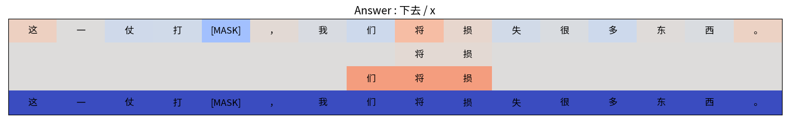

# Chinese Complement (补语) Classification and Explanation

> This repository is a source code of a paper : *Automatic Prediction and Linguistic Interpretation of Chinese Directional Complements(趋向补语) Based on BERT Model*

- We used Sampling and Occlusion algorithm used in [Contextualizing Hate Speech Classifiers with Post-hoc Explanation](https://arxiv.org/pdf/2005.02439.pdf) 
- This code is reimplementation of [original code](https://inklab.usc.edu/contextualize-hate-speech/)

# Environment

`conda create -f environment.yaml`
`conda activate soc_env`

# How to run

## 1. Train

`./scripts/run_train_buyu.sh {gpu_id}` 
- Automatically trains four 补语 classifiers (下去，下来，出来，起来)
- You can change hyperparameters from script

## 2. Explain

`./scripts/run_explain_buyu.sh {gpu_id}`

runs explanation with the `test` data

- `--output_dir` : directory of classifier model
- `--lm_dir` : directory of language model (different with classifier)
- `--nb_range` : window size to sample n
- `--sample_n` : number of sentences to sample
- `--hiex` : hierarchical explanation (default : sequential explanation)
- `--output_filename` : name of the explanation file

explanation result is saved in `output_dir`

## 3. Visualize

`./scripts/run_visualize_buyu.sh``

- `--input_file` : file dir to visualize (*.txt, *.heix)
- `--buyu` : buyu #
- `--hiex` : true if hierarchical explanation

---

# Final output

Example of Sequencial Explanation


Example of Hierarchical Explanation



# How to modify

## 1. Prepare data

```bash
|----data/buyu
|----|----train.json
|----|----dev.json
|----|----test.json
```

- `Binary label`

## 2. Modify data processor

`loader/*.py`

- modfiy `class *Processor` 

---


## Reference

```
@inproceedings{kennedy2020contextualizing,
   author = {Kennedy*, Brendan and Jin*, Xisen and Mostafazadeh Davani, Aida and Dehghani, Morteza and Ren, Xiang},
   title = {Contextualizing {H}ate {S}peech {C}lassifiers with {P}ost-hoc {E}xplanation},
   year = {to appear},
   booktitle = {Proceedings of the 58th {A}nnual {M}eeting of the {A}ssociation for {C}omputational {L}inguistics}
} 
```
